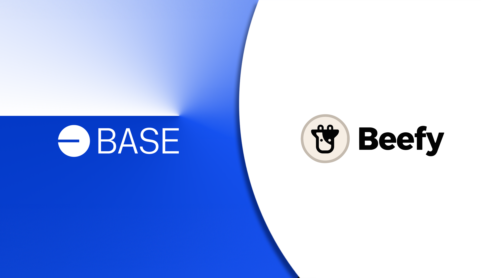

It’s vacation season people; time for some time off! But whether you’re laying on a beach, hiking in a foreign country or just minding the kids in your own backyard, you definitely don’t want to miss out on the amazing DeFi incentives out there. At times like this, it pays to have a yield optimizer handle all your farming needs for you. You can leave your screens behind. 😎

I guess then now would be a bad time to launch a major new blockchain. 😅 You’d think they wouldn’t make you choose between your precious holiday and a once-in-a-chain’s-lifetime opportunity for amazing new incentives?! Gah, if only you could pick up and move your favorite protocols straight to the new chain… 

Today, we’re thrilled to be announcing Beefy’s launch on Base - a brand new optimistic rollup chain brought to you by Coinbase. Imagine all the potential of your favorite rollups like Optimism, but combined with Coinbase’s 100 million users. Yeah… this is going to be big!

And Beefy’s here to make sure you don’t miss out. 👇

### Coinbase x Optimism

You may be wondering why the poster child for regulated cryptocurrency trading in the US would want to encourage decentralized finance. Surely if everyone switches to trading their crypto on decentralized exchanges (**DEXs**), competing centralized exchanges (**CEXs**) like Coinbase will lose their share of the market! Well, that’s not how Coinbase sees things…

Ultimately, CEXs provide the key onramps needed by most people to gain access to the decentralized web. The more self-custodial use cases for your crypto, the smaller of a proportion CEXs will occupy in the wider market. But a smaller percentage of a much bigger market still means a lot more business for the CEXs. By facilitating on-chain activity, Coinbase can help to grow the market for all of its services.

That’s how the idea arose for Coinbase to create a new playground for decentralized finance, together with some of the best in the industry. And that’s why Coinbase selected Optimism, and its OP Stack, as the partners of choice to help deliver on this vision. By coupling access to Ethereum’s security, with Optimism’s fast and cost-effective optimistic rollup technology, Coinbase can bring a trusted and performant DeFi environment to its millions of users.

### Base

The culmination of these efforts is [Base](https://base.org/) - an easy way for the decentralized world to leverage Coinbase’s products and distribution, and for Coinbase’s millions of users to arrive on chain. Base will initially be run by Coinbase’s own sequencer built on the OP stack, though with the opportunity to gradually decentralize the chain over time, allowing it to offer the best of both worlds. Together, this combination looks like the perfect storm for DeFi activities.

It’s been almost 6 months now since the plans for Base were first unveiled, so you can imagine the level of hype and excitement building across the ecosystem. In launching on Base, Beefy joins dozens of other projects aiming to arrive early and take advantage of all that Base has to offer. The DeFi world is clearly optimistic about Coinbase’s plans.

Bringing together all these efforts, Base is kicking things off with its [Onchain Summer campaign](https://onchainsummer.xyz/). By being among the first to bridge onto Base in August, you can earn yourself a limited edition NFT. You can also earn $1 in ETH through a new quest on the Coinbase and Coinbase wallet apps. Base will also be running an [initial grants programme](https://prop.house/base/build-on-base) for early builders, offering 100+ ETH in grants in partnership with Prop House. They’re definitely trying to tempt you back from your holidays. 😉

### Get Me There

Naturally, the best way to soak up all of these new incentives is to get your funds deposited into Beefy. But first you’ll need to make your way onto Base and get some gas!

To get started, you can bridge onto Base from Ethereum by using the [official bridge](https://bridge.base.org/). Or if you’d prefer to bridge from other chains, unofficial bridging services like [Hop](https://app.hop.exchange/) and [Portal](https://www.portalbridge.com/#/transfer) are already open for business, with more following soon.

Make sure to bridge yourself some Ether first, as this is the native currency for paying gas on Base. You can then swap into whichever cryptoassets you’d like through one of the live DEXs on Base, such as [SushiSwap](https://www.sushi.com/swap) or [Velocimeter](https://www.velocimeter.xyz/). To review your transaction details, check out the [Base Block Explorer](https://basescan.org/).

Once you’re all set up, you can find out more about all the great projects on Base through their [DefiLlama page](https://defillama.com/chain/Base).There’s already around 20 different projects live on the chain, and it hasn’t even officially launched yet! If you have technical questions or want more information, check out the [Base Documentation](https://docs.base.org/).

But seriously… save yourself some extra vacation, and just head straight to [Beefy](https://app.beefy.com/).

### Onchain Summer

There’s nothing quite like the launch of a major new chain to get builders fired up and new incentives flowing. And with the promise of over 100 million Coinbase users being encouraged to use Base, it’s clear that the chain has massive potential. Time to make sure you’re at the center of it, and soak up all the opportunities from this Onchain Summer

Base launches officially on 9 August 2023. And Beefy will be there every step of the way, so you won’t need to lift a finger to earn more of the tokens that you love.

[Base](https://base.org/) | [Base Bridge](https://bridge.base.org/) | [Base Explorer](https://basescan.org/) | [Base Docs](https://docs.base.org/)