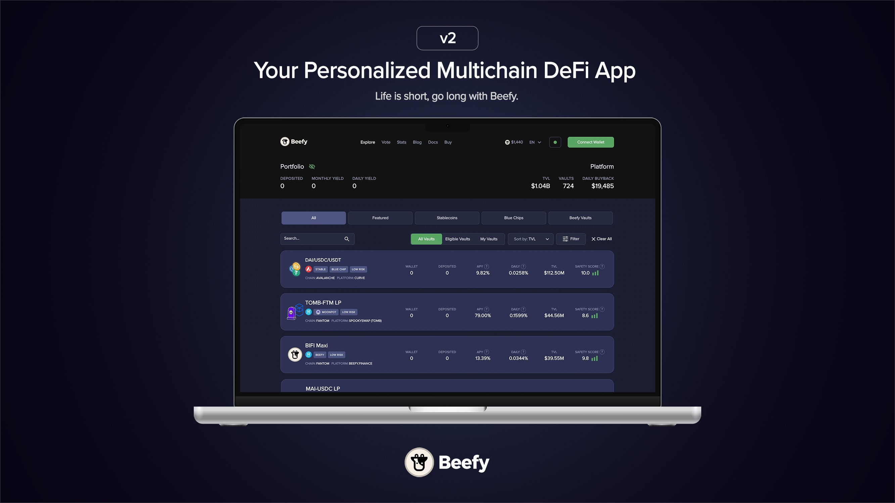
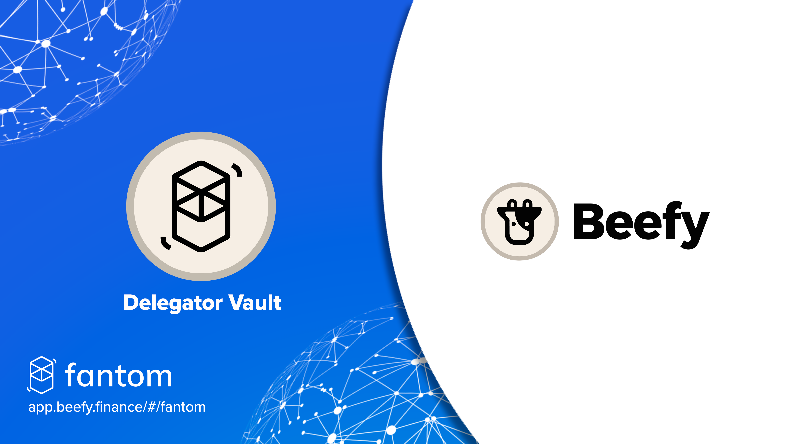
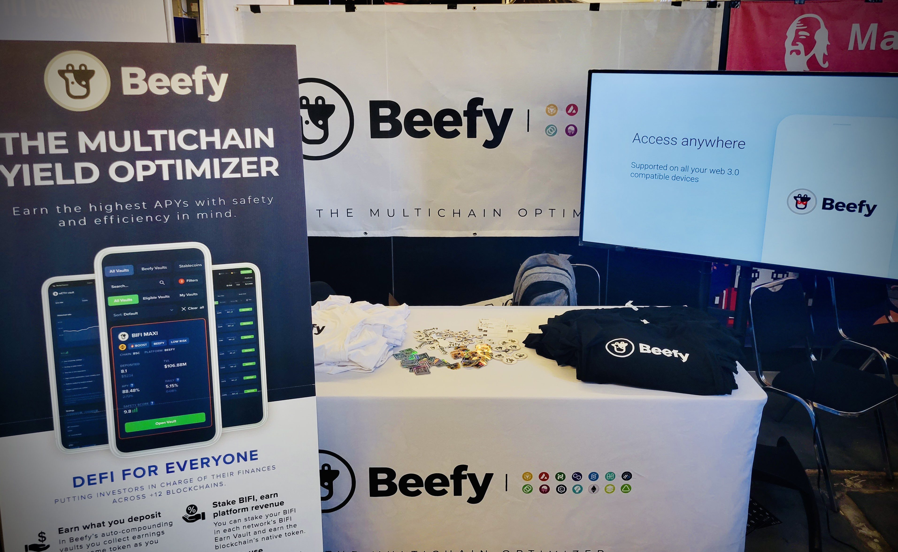
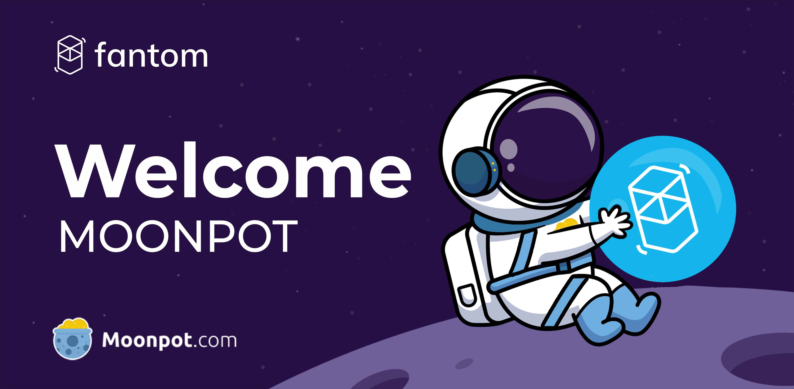
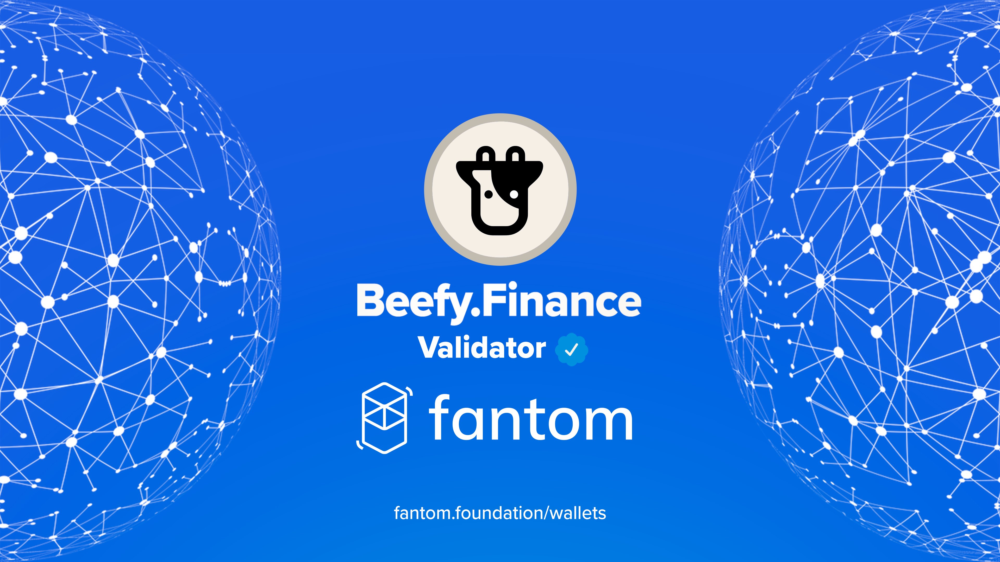
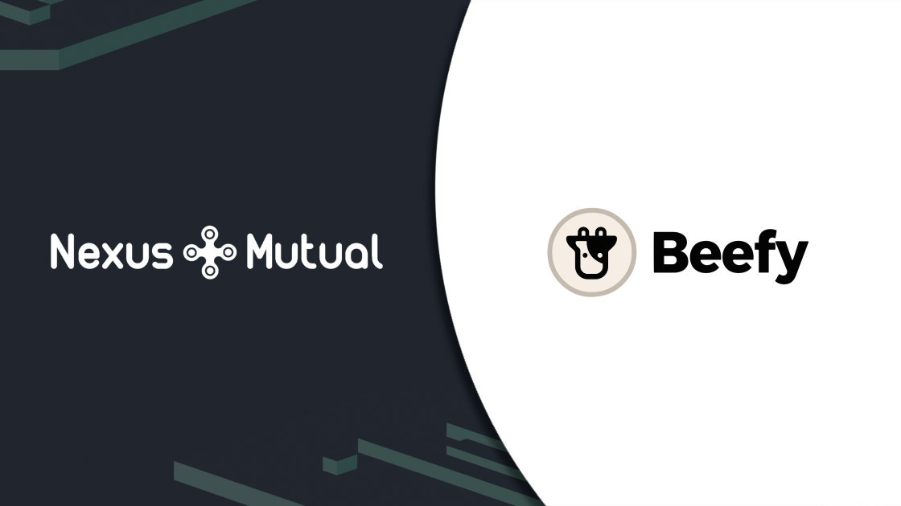

The start of the year and Q1 can often feel like a flash in the pan. That doesn’t stop us however from filling it full of DeFi goodness. Particular highlights include two terrific tokens for maximizing rewards, powerful partnerships, new networks, and juicy staking opportunities. It’s been a bumper few months, and we’re here once to give you a round-up of the best.

And as always, we have some great DeFi insights from the team that you just won't find anywhere else. Not too bad for February and March hey?

### DeFi marketing basics with TheBeefyCow

With DeFi being such a new industry, the ins and outs of DeFi marketing can often be mysterious. That’s why we’ve invited Beefy’s marketing maestro TheBeefyCow to lay down some real basics and ground rules.

**In the DeFi world partnerships are key. How do you keep up with so many and ensure their quality?**  
The truth is, you can’t keep up. You try your best to pay every project the respect they deserve. However, the sheer number of interactions on Telegram, Discord, Email, Twitter, and every other tool used in DeFi can have you chasing the red notification banners all day. So you do what you can to organize, prioritize, and filter every discussion in a meaningful way.

When it comes to partnerships, one of the best tools Beefy has that allows us to sort projects quickly is our SAFU Requirements. If a project reaches out it is pretty easy to just provide them with the Beefy SAFU checklist. This makes sure they have everything lined up before we even progress with partnership talks.

\*_What makes DeFi marketing different from other industries? What are the challenges?  
\*_  
Time and money are both challenges, but not in the traditional meaning of that phrase. DeFi DAOs are not companies with roots in any country or jurisdiction. We do not operate on a 9-5 standard, and it seems everyone you work with is in another timezone on the other side of the globe.

Think back to the difficulties in managing partnerships mentioned in the first question, now add the need to be available at all hours to it. Along with the speed of DeFi, where weeks are months, and months are years, trying to get your product in front of everyone's eyes without being repetitive is a nightmare.

So, you commit, go, and pump out everything as you get it, and try not to forget about the product you shipped yesterday while shipping the other 15 products over the next two days.

Money is another major issue that we have to deal with as a DAO. Although Beefy is profitable and has multiple revenue streams, all of the funds Beefy earns are in crypto. Offramping that crypto to fiat is a huge problem when the entire DAO works in anonymity.

Trying to market a DeFi product in traditional arenas becomes a challenge when you realize that everyone expects payment by credit cards, or does not understand DeFi projects and assumes a DeFi project is just another company.

The world has not embraced the acceptance of crypto payments enough to allow a DAO to run televised commercials without sacrificing DeFi values.

**Beefy keeps up an extremely active Twitter presence... what's your secret?**

The secret is Beefy has the best graphics guy in the industry. Being able to work with YR is an absolute pleasure. When you have the opportunity to work with highly talented people, and in this case the best, you step up your game at all costs.

As well as an extremely busy Devs Team. Devs just keep shipping vaults and innovative ideas that there is always something Tweet worthy to send out. But, in the end, it is all about dedication, and basic work ethic.

There are no days off. Beefy has averaged 6.3 tweets a day for a year. Most of these are tweets dedicated to their own unique new Beefy product, so each gets its own graphic and copy. Some tweets are easy to create as certain projects allow creativity to flow, and others… well you just try your best when you get the majestic $USDT - $USDT LP.

Finally, all tweets ship through the Beefy Twitter DAO. This requires the Cowmoonity to proof and approve all tweets to send. This is an absolutely fantastic feature that Beefy has access to that allows the DAO to participate and take responsibility for the content.

The Cowmoonity has a few members who I’m pretty sure are professional editors or maybe professors of linguistics because all 3 levels of editing: substantive, copy, and proof are always active.

I’ve been part of too many debates over grammar, and word choice over the last year. And hyphens, oh man hyphens… I always have to remind the Cowmoonity that this is Twitter, there are character limitations, and they always remind me that my puns and 90’s pop cultural references do not always translate to a worldwide population of 20-year-olds.

**What tips can you give the Cowmoonity when looking at a project's marketing? Are there red flags that can easily be spotted?**

If you heard about a project because it randomly appeared in your Telegram it’s a scam.

### Welcome to Beefy V2

If you’ve used Beefy recently, you’ll have certainly seen our new look. After a beta period, we’ve finally rolled out a brand new UI and UX experience for all users. From safety scores to helpful hints and tips, the Cowmoonity should be able to browse our Vaults with total ease.

### Beefy.finance becomes Beefy.com

Perhaps you might have missed it, but Beefy has gone through a bit of a rebrand. Beefy.finance has now changed to Beefy.com. So next time you tell your friends about the best place to optimize their yield, you only need to mention Beefy - hold the finance.

### Beefy brings binSPIRIT to the market

SPIRIT staking just got even more rewarding. binSPIRIT is Beefy’s wrapped version of inSPIRIT. By perpetually locking SPIRIT and holding inSPIRIT, Beefy maximizes the rewards gained.

The more SPIRIT locked in binSPIRIT, the higher the boost will be for Beefy. binSPIRIT is transferable, unlike inSPIRIT, and can also be staked for even more gains. You can get your hands on binSPIRIT by minting it when at or over peg, or purchasing it when under peg.

### Maximize your FTM rewards with beFTM

If you like the sound of binSPIRIT, then [https://blog.beefy.finance/articles/introducing-beftm/](https://blog.beefy.finance/articles/introducing-beftm/) is right up your street too. Although technically a March launch, we don’t want to waste an opportunity to tell you how you can earn more rewards.

beFTM stands for Beefy Escrowed Fantom. The token is backed 1:1 by FTM and gives stakers access to maximized validator rewards. As Beefy stakes as one entity, this gives you yield unavailable to smaller investors. Beefy’s new smart minter will also determine whether it’s more profitable to purchase $beFTM or to mint for you.

### ETHDenver got a taste of Beefy back in February

At the beginning of February, Weso made an in-person appearance at ETHDenver. Apart from manning the Beefy booth, Weso also took part in the JustDAOIt panel discussion. If you feel like getting a bit of Weso in your life, you can watch the panel back on the [ETHDenver Youtube channel](https://www.youtube.com/watch?v=C5tSUFOSpP0).

### Vault technology powers three new Moonpots

March saw our partner project Moonpot launch three new Pots on Fantom. Both binSPIRIT and beFTM holders now have two new use cases through staking with Moonpot. If you want to learn more about how Moonpot and Beefy collaborate, make sure to read our explainer

### 

### Beefy supports Moonbeam

Beefy loves getting in first. As Polkadot’s first fully-functional parachain, we saw an opportunity and we took it. You can now invest in Beefy Vaults on Moonbeam through LPs and farms on Beamswap, one of the parachain’s most popular DEXs.

If you’re already familiar with Moonriver, you’ll be in for a treat. Moonbeam comes from the same team and is a great place for cross-chain integration too. Read more about our partnership [here](https://blog.beefy.finance/articles/introducing-our-brand-new-moonbeam-vaults/).

## Beefy becomes a validator on two networks

Becoming a network validator is part of our work in securing the highest yield possible.

February saw Beefy become an official validator for Fuse network and Fantom. Apart from improving your gains, our validator status also shows commitment to the networks and our support for the community.

### Cover your deposits with Nexus Mutual

Everyone likes reducing risk, and the Cowmoonity is no different. That’s why we’ve onboarded a new insurance alternative to our UI. Nexus Mutual is an Ethereum-based project protecting its users from a range of DeFi related losses. These include Custody Cover, Yield Token Cover, and Protocol Cover. You can get started through the link in the Beefy header, and read more about it in our [blog post](https://blog.beefy.finance/articles/cover-your-deposits-with-nexus-mutual/)

### Gelato decentralizes our Vault harvesting

Our previous in-house solution for vault harvesting has now been laid to rest for a selection of Vaults. With [Gelato](https://blog.beefy.finance/articles/thanks-to-gelato-beefy-is-now-even-more-decentralized/), 100+ vaults will automatically harvest rewards at predefined time intervals and economic conditions. Automating key functions like harvesting via Gelato’s decentralized infrastructure offers users a better overall Beefy experience.

### Buy $BIFI with fiat with Transak

Sometimes we don’t always have crypto on hand to stack $BIFI. Now with Transak, you can get your hands on $BIFI with a credit or debit card. Simply click the card icon in the Beefy header to start the process. Onboarding to Beefy has got even easier, so why not join the party?
