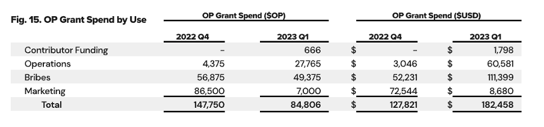

We all know the truism that *the whole is greater than the sum of its parts*. As we dive deeper into the theory and economics underlying decentralized finance, we are confronted time and again with the fundamental principles of game theory: *it’s only if we are able to coordinate ourselves and work together effectively in the same direction that we can hope to achieve an outcome that is truly optimal*. 

It’s been a little over one year since Beefy first deployed on Optimism’s OP Mainnet and a whole lot has happened in that time. But looking back with the benefit of hindsight, we can safely say that it’s been an incredible year of building technologies and communities for both of our teams. In particular, our shared vision of to creating and maintaining the optimal liquidity layer for Ethereum has moved forwards with tremendous pace.

In this article, we look back with a smile at an amazing first year with Optimism, recapping some of the highlights and reasons for our successes. And we’re also excited to look forward at some of the reasons to stay bullish and optimistic for Beefy’s future on Optimism…

### Optimism

For those not yet familiar, Optimism is a leading blockchain collective, aiming to scale Ethereum by building for the public good. Its leading optimistic rollup technology has slashed the cost of living on Ethereum, and the recent [Bedrock upgrade](https://community.optimism.io/docs/developers/bedrock/explainer/) and growing [OP Stack](https://stack.optimism.io/) are poised to deliver low-cost and efficient rollups (including Coinbase’s [Base](https://base.org/) chain) to meet the ever growing demand for block space.

Unique amongst the major blockchains, Optimism exudes deeply-routed values of community, governance and public goods throughout its operations and ecosystem. A core tenet is the concept of retroactive public goods funding (**RPGF**), which means ensuring those creating value and utility for the ecosystem will be funded for their efforts, so they can invest their time wisely with the backing of their community. By carefully issuing and distributing Optimism’s $OP governance token over time, the ecosystem has achieved an outstanding virtuous cycle, which is propelling decentralization forwards at an incredible pace.

Optimism’s main blockchain – now known as OP Mainnet – opened its gates to outside developers in December 2021. As liquidity gradually took route on the chain, Beefy deployed its first vaults at the end of June 2022, kickstarting one of our most fruitful partnerships to date.

### Governance Fund Grants

To help deliver on its mission for RPGF, the Optimism Governance Fund and Grants Council was launched in early 2022. The Fund represents the allocation of new $OP tokens for RPGF, with the Council having responsibility for the distribution of tokens to ecosystem participants. Since its founding, the Council has completed 12 separate grant cycles in 3 seasons, and is now embarking on its latest wave.

In July 2022, Beefy participated in the first season of the Optimism Governance Fund’s grant programme. [Our proposal](https://gov.optimism.io/t/ready-gf-phase-1-proposal-beefy/2967) explored the use of incentives in the yield farming lifecycle as a mechanism to attract and retain users and liquidity providers within the ecosystem. In particular, we suggested boosting native project’s vaults, incentivizing developers for new deployments and creating pools, farms and vaults for $OP (including our [BIFI-OP vault](https://app.beefy.com/vault/velodrome-v2-op-bifi)).

Along with 40 others successful participants, our proposal passed through governance and we [received](https://optimistic.etherscan.io/tx/0xe39cf61c022ed308c165c389ae2a066d1ea2e3fb7c4210166ef0e47d3dce8f2e) our full requested award of 650,000 $OP tokens on 12 September 2022. And what happened next, you won’t believe…

### Beefy Grant

Since that time, Optimism has catapulted up the ranks to become Beefy’s largest chain by total value locked (**TVL**). At our peak, Beefy has been compounding as much as $80 million of assets on OP Mainnet, across well over 100 different vaults. This reflects 11,000 unique addresses currently holding assets in Beefy’s Optimism vaults, which in turn are supplying liquidity to over 10 different partner protocols across the ecosystem. 

In just under 10 months, we’ve distributed close to 300,000 $OP tokens – approaching the halfway mark for our initial allocation. As both TVL and the price of $OP have steadily increased, we’ve adjusted out pace of distribution, and focussed in on maximizing bang for our buck.  For instance, our longstanding bribe programme on [Velodrome ve(3,3)](https://beefy.finance/articles/beefy-velov2/) DEX has maintained exceptional returns as the price of $OP has increased and the quantity used to bribe has been tapered.

[Financial analysis](https://www.docdroid.net/Ds2ZSwS/beefy-quarterly-report-march-2023-pdf) over recent quarters shows a broad range of activities across the Beefy ecosystem, all rowing in the same direction towards optimal liquidity. In addition to bribes and liquidity, we’ve also incentivized external developers for deploying new vaults, run comprehensive marketing campaigns to attract users, and invested in developing new tooling and technology for delivering liquidity to participants (and vice versa!).

Having deployed on 20 different blockchains over our short history, it’s safe to say that the experience in Beefy’s first year on Optimism is unparalleled.

### Boost Week

By now you may be thinking “well great, but how are you going to live up to this with the encore”… well, our careful and diligent use of grant funds from the first season means there’s still plenty more to come. And today, we’re kicking off our second year on OP Mainnet in style, with our second ever Boost Week.

Starting on Monday 10 July, we’ll be launching a boost each day for the next week, in the hope of distributing thousands more $OP tokens to our users throughout the rest of July. As usual, we’ll be teaming up with some of our biggest partners on Optimism, to highlight the amazing work going on across the ecosystem. Altogether, we’re very excited to showcase another round of the best in liquidity and incentives from across decentralized finance. 

We’ll be kicking things off with our [VELOV2-USDC Vault](https://app.beefy.com/vault/velodrome-v2-usdc-velo) today, with new boost announcements coming each day via Beefy’s [Twitter](https://twitter.com/beefyfinance), [Discord](https://discord.gg/yq8wfHd) and [Telegram](https://t.me/beefyfinance). Keep your eyes peeled for the pre-stake, to make sure you soak up every single second of boosted liquidity in July.

### A Master Class in Liquidity Incentivization

We at Beefy are delighted to look back on an incredible first year on Optimism, and all that we’ve achieved together. Despite chaotic markets, unscrupulous bad actors and exceptionally hostile regulators, Beefy and Optimism have sailed quietly through to focus on building exceptional products and enduring communities. And as we look forward to another year of building, we’re excited to kick things off with Boost Week 2023.

So here’s to Optimism, Beefy, and another exceptional year of liquidity incentivization for you all. Cheers. 🍻

[Optimism Ecosystem](https://www.optimism.io/) | [Beefy Grant](https://gov.optimism.io/t/ready-gf-phase-1-proposal-beefy/2967) | [Financial Reporting](https://www.docdroid.net/Ds2ZSwS/beefy-quarterly-report-march-2023-pdf) | [VELOV2-USDC Vault](https://app.beefy.com/vault/velodrome-v2-usdc-velo)