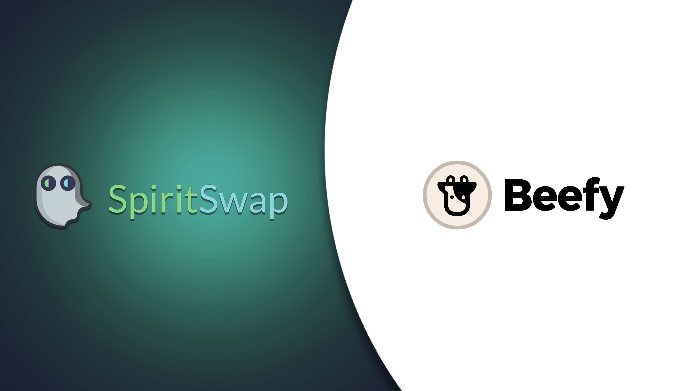
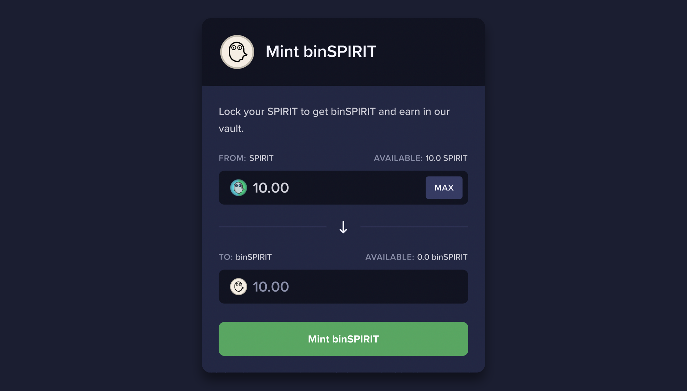
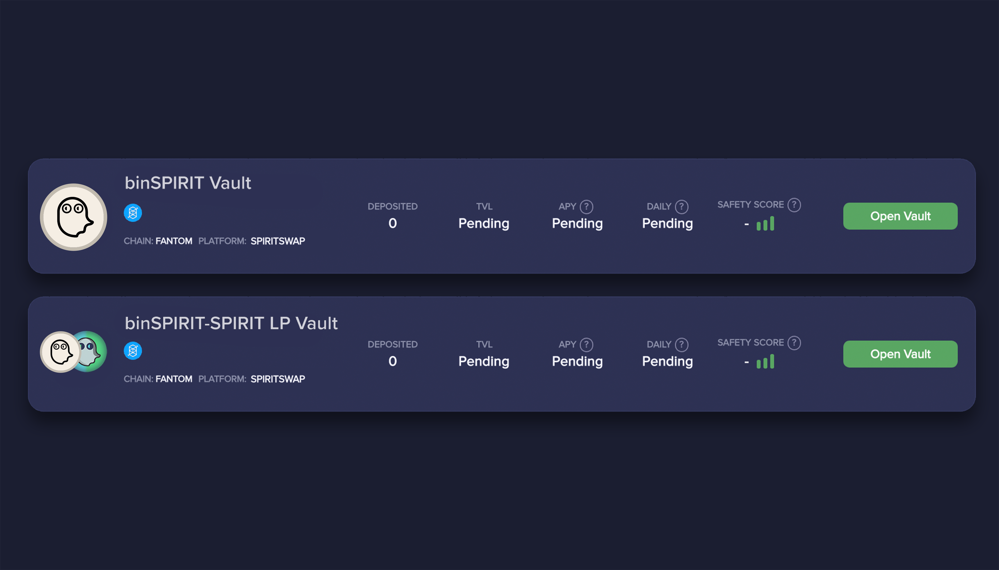
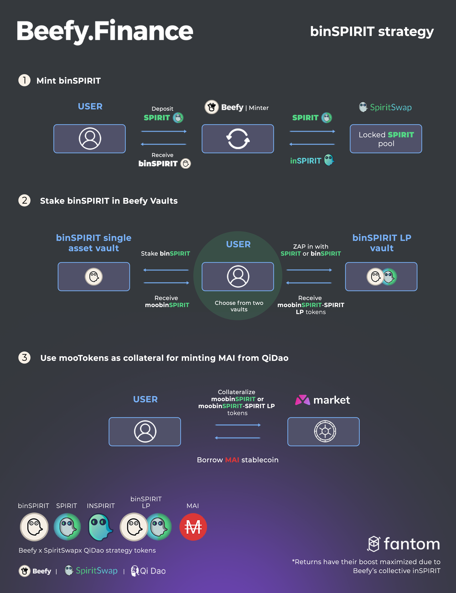

  
If you’re a fan of SPIRIT staking on Fantom with SpiritSwap, then you’ve come to the right Cow. From February 2, 2022, you’ll be able to mint binSPIRIT through Beefy Finance, giving you the best chance of maximizing your reward boost. But that’s not all. binSPIRIT is a fully transferable token and can also be used to borrow MAI on market.xyz through QiDao’s seeded locker.

Whether you’re new to SpiritSwap farms or just need a recap, have no fear. We’ve outlined the key basics for you to get to grips with below.

### What is inSPIRIT?

When users lock their SPIRIT tokens in SpiritSwap for between 1 week and four years, they receive a proportional amount of inSPIRIT. inSPIRIT is non-transferrable and the amount in the holder's wallet decreases steadily to 0 until the lock is over.

inSPIRIT holders can claim protocol revenue fees (variable week by week but they have been up to 80% APR) and receive up to a 2.5x boost in farms. The boost depends on the user's balance of inSPIRIT compared to all other holders and the balance they have staked in the farm compared with the farm’s TVL. This mechanism means that small holders are very unlikely to get a boost. You also will not be able to liquidate your position until the end of the time lock.

Here’s where Beefy comes in.

### How does binSPIRIT work?

Put simply, binSPIRIT is a wrapped version of inSPIRIT. The token allows Beefy to lock SPIRIT perpetually for rewards but also gives users a transferable version of inSPIRIT. This can then be used in Beefy Vaults to earn even more APY. Beefy benefits from holding inSPIRIT as it allows for boosted rewards on the SpiritSwap farm up to 2.5X. The more SPIRIT is locked in binSPIRIT, the higher the boost will be for Beefy.

This means all SpiritSwap vaults will see an increase in their APY thanks to this locking.

You can get binSPIRIT in the same way as beFTM. If binSPIRIT is under-peg you can purchase the token, if it's at or over peg you can mint it using inSpirit.

Through arbitrage, binSPIRIT should maintain a 1:1 peg with SPIRIT. If binSPIRIT’s price is lower, it’s more expensive to mint binSPIRIT yourself. Users will simply purchase binSPIRIT on the open market and stake it in the binSPIRIT vault, increasing its demand and price.

When binSPIRIT is more expensive than SPIRIT, SPIRIT holders will mint binSPIRIT and sell it on the market for its higher price. An increase in supply will lower the price back to its peg.

### Beefy’s inSPIRIT voting power

Through holding inSPIRIT, Beefy will also gain voting power on SpiritSwap farm emission allocations. 1 inSPIRIT is equal to one vote and can also be used for improvement proposals in SpiritSwap’s snapshot governance system. With our inSPIRIT bag, Beefy will vote for increased incentives for BIFI-FTM and MAI-FTM as part of our partnership with QiDao.

### binSPIRIT-SPIRIT and binSPIRIT Boost

To begin with, our binSPIRIT-SPIRIT farm won’t have emissions. That’s why we’re setting up a juicy boost where users can deposit their binSPIRIT-SPIRIT LP on Beefy and earn moobinSPIRIT (binSPIRIT that is already deposited in our vaults). This mechanism will motivate users to lock their SPIRIT with us, bootstrapping the first weeks of liquidity on the pair. Later we will vote on emissions using our voting power.

We will be also boosting the binSPIRIT vault with mooBIFI.

### What can I do with binSPIRIT?

Beefy users can get binSPIRIT by either minting it with SPIRIT tokens at a 1:1 ratio or purchasing it on SpiritSwap. binSPIRIT holders then have two options:

1. They can use their tokens as liquidity with SPIRIT in the binSPIRIT-SPIRIT liquidity pool on SpiritSwap and place the LP tokens in our binSPIRIT-SPIRIT Vault.
2. They can stake binSPIRIT in a single asset Vault, with rewards coming from SpiritSwap protocol fees.

   

### Use your mooTokens as collateral for MAI with QiDao

If you’ve decided to deposit your binSPIRIT in a Beefy Vault, you can extract even more value out of them with QiDao. Your moobinSPIRIT and moobinSPIRIT-SPIRIT LP tokens can both be used as collateral for borrowing MAI, QiDao’s stablecoin, via pools on [_market.xyz_](http://market.xyz). You can read more about the process in our [_QiDao x Beefy article_](https://blog.beefy.finance/articles/your-mootokens-are-really-valuable-now-even-more/), as well as explore all our strategies in the infographic below:

These markets will be live in Fantom during the week of the 7th of February.

### Unlock your portfolio’s potential and earn more with Beefy

Once again, the Beefy Cow has found another way to extract as much juicy value from your tokens as possible. By minting your binSPIRIT with us, you’ll enjoy even more benefits than going it alone. Don’t forget to stake your binSPIRIT with us for even more rewards and the possibility to collateralize your interest-bearing tokens.
