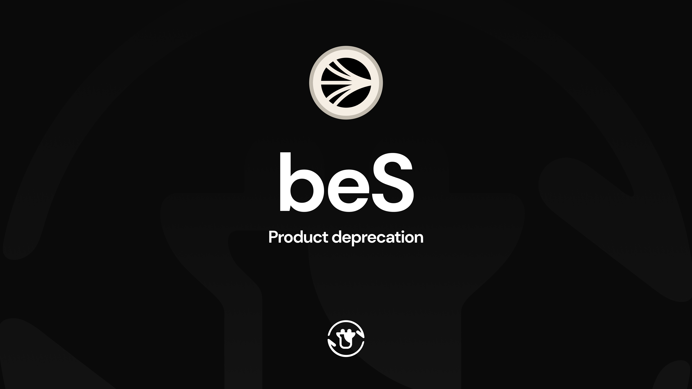

It's true what they say, you know: **all good things must come to an end.**

As Beefy's 6th birthday approaches, we've started to get a little sentimental about our history. In recent weeks, Beefy reached our 42nd blockchain - a point where we can confidently say that the number of live chains will never again exceed the number that have already come and gone. Similarly, our over 1,000 live products are now just the tip of a much larger iceberg, as we hunt down the 6,000th product milestone in the coming months.

All those experiments... so many successes... even more lessons learnt. Though Beefy endures, our survival is contingent on our ability to gracefully draw a line under the things that are no longer working, while retaining confidence in our plans further up the road. We wear our deprecations as a badge of honour, and never forget the good times past or the hard lessons learnt.

Today, we announce the deprecation of Beefy's Sonic products and integrations, our Sonic validator, and our Beefy-escrowed Sonic (beS) product line. Rewards from our validator and yield from our Sonic products have stopped, and users should withdraw their remaining positions. Below, we reflect on our time on Sonic and explain the withdrawal routes for delegators, beS holders and retired vault users.

### beS on Sonic

When we [launched beS](https://beefy.com/articles/bes/) in April 2025, we sought to make a splash. As an independent L1 using the Ethereum Virtual Machine, Sonic was easy to integrate while incentivizing a large set of validators to help support the chain's operation and neutrality. This meant a plethora of staking rewards available, and a race to launch liquid-staking tokens to help support the chain and distribute that yield across its user base.

beS was built differently: lower fees than most competitors, a liquidity locker used to bribe and incentivize beS liquidity, and a raft of launch integrations with Shadow, Beets, SwapX, DeFive and Origin. The product was also built around Beefy's own validator, avoiding reliance on an external validator operator and directing rewards to our DAO and users. In the first few months, beS received significant levels of deposits including a large inflow from the Sonic Foundation.

But, it wasn't to last. Though we continued to perform well against competitor products, the Sonic ecosystem struggled against bearish conditions. From a peak of over $1 billion in DeFi TVL in May 2025, activity gradually descended to under $100 million by December. Other chains optimising for similar performance levels also struggled, and increasing consolidation was seen in a series of other well-established chains. Our time on Sonic was drawing to a close.

### Deprecation

As we draw a line under our time on Sonic, the process of deprecating requires some special attention:

Foremost, our validator has now been exited, and Beefy's self-staked liquidity withdrawn. This means the validator is inactive and not earning rewards for anyone. Despite this, over 2 million S tokens remain delegated to our validator; we strongly urge any independent delegators to withdraw their stake. A selection of other validators remain live, and positions can be managed from the [mySonic staking dashboard](https://my.soniclabs.com/stake/validators).

For beS users, this also means that you are no longer earning S rewards simply by holding beS. Don't fear, all of the underlying S deposits and earnings are still being managed by the token contract and are available for withdrawal. To initiate a withdrawal, head to the [**beS product page**](https://app.beefy.com/vault/beefy-besonic) on Beefy and use the Withdraw tab. Due to the way Sonic's staking is structured, withdrawals take 14 days from the initial request and are available to claim after that period from the Beefy UI.

Alternatively, a small amount of beS liquidity is still available on various DEXs on Sonic. Users not wanting to wait for the withdrawal period can swap immediately through the liquidity. With that said, the discount to the underlying S redemption value could widen as liquidity shrinks. For users aiming to maximise their withdrawals, we strongly recommend withdrawing directly from the product rather than swapping through liquidity pools.

Finally, the remainder of Beefy's Sonic products have also now been deprecated. All funds have been withdrawn to the strategies, meaning they're available to withdraw at any time but not earning yield. While the chain has been hidden on the Beefy app, connecting the relevant wallet will showcase all relevant retired products in the "My Positions" tab. Fortunately, Sonic is still fully functional with Circle's CCTP bridge, meaning crosschain zaps are still possible. Users can zap now from retired products on Sonic directly into other Beefy products on 9 other chains.

### Looking Forward

With beS, the validator, and the whole Sonic integration now retired, Beefy can look forward to consolidating our efforts and screen real estate around newer generations of products and chains.

For beS holders, now is the time to request a withdrawal through the beS product page, then return to claim your S after the 14-day withdrawal period. For users of our other retired Sonic vaults, positions are available to withdraw now, or you can use Beefy's Crosschain Zaps to move directly into products on other chains. Independent delegators should withdraw their stake through the mySonic staking dashboard. Though deprecated products will continue to appear on our UI, you won't be earning any yield by depositing and may find exiting more difficult should liquidity dry up or other integrations sunset.

**All good things must come to an end.** The secret is knowing when to move forward...

[**beS on Beefy**](https://app.beefy.com/vault/beefy-besonic) | [**beS Documentation**](https://docs.beefy.finance/beefy-products/beefy-escrowed-tokens/bes)