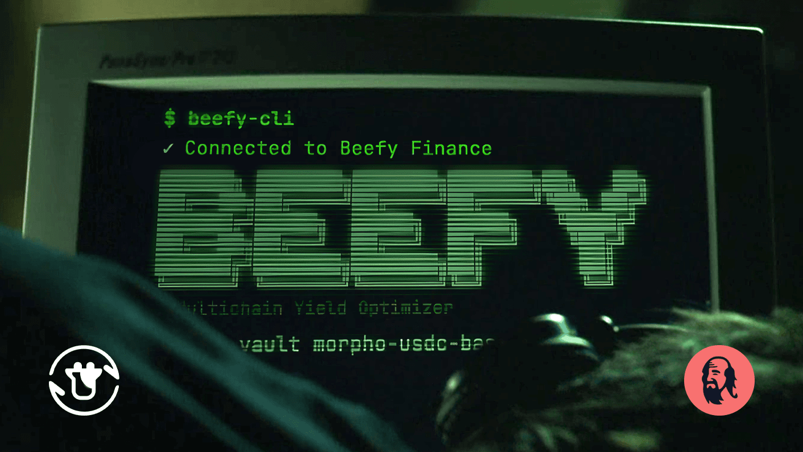
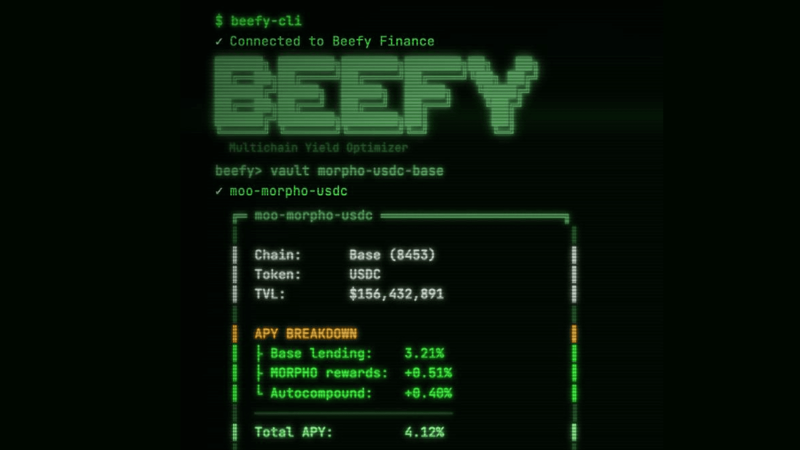

The times they are a-changin’.

No one can know the scale of impact that artificial intelligence will have in the near future. The distinct possibility of a seismic change makes it impossible to ignore. 

If you’re not preempting the replacement of humans with artificial agents at every stage of life, then you’re probably going to be caught off-guard.

For DeFi protocols like Beefy, the most obvious route for AI interaction is as a layer between our users and our products. AI can undoubtedly save time browsing our thousands of products, monitoring their performance and migrating to the latest opportunities.

Such AI users also present an opportunity for Beefy to win new deposits. By supplementing our hallmark user interface with a leading agentic interface, we can make Beefy among the most obvious choices for agents to deploy capital when exploring the market.

Building on that vision, we’re excited to support our friends at QiDao with the launch of their new product *Goldbot Sachs* — an agentic skill that allows any onchain agent to earn passive income on idle stablecoins by deploying them into Beefy.

## QiDao

Cowmoonity members of old will remember fondly our enduring partnership with QiDao:

[Since 2021](https://beefy.com/articles/your-mootokens-are-really-valuable-now-even-more/), Beefy has integrated MAI products, offered mooToken collateral for MAI loans, and toiled hand in hand with QiDao to promote our efforts. [Beefy built](https://beefy.com/articles/beqi/) the longest-running QI liquid-staking tokens in QiDao’s history, and QiDao became one of the largest BIFI holders in Beefy’s history.

As QiDao continues to evolve and explore new markets, we’re delighted to support their efforts in building agentic DeFi tooling. Through [cryptoskills.sh](http://cryptoskills.sh), they have begun building a host of skills for onchain agents covering various DeFi protocols and functionalities.

We’re honored that QiDao has chosen to integrate Beefy as a yield source for their agentic products. And we’re thrilled to support the launch of their latest product — [Goldbot Sachs](https://goldbotsachs.com).

## Goldbot Sachs

Goldbot is an agentic skill that empowers onchain agents to earn yield on idle USDC held in accounts they control. Agents only need access to the [skill file](https://goldbotsachs.com/skills/goldbot-sachs.md) and the necessary wallet controls/approval to start deploying funds.

Underneath the hood, the skill instructs agents to use the clawUSDC vault — an ERC-4626 vault that routes deposited USDC into Beefy’s USDC Morpho vault. The agent doesn’t even require gas to operate, as Goldbot includes a gasless refuel mechanism that sells a small amount of USDC via CoW Protocol.

Whenever USDC is deposited into clawUSDC, the underlying assets are immediately passed on to Beefy to earn idle yield. And when the user needs to access their funds, Goldbot can withdraw from clawUSDC immediately. There’s no fee, penalty or lockup for using the service; just simple yield on idle stables.

What’s more, QiDao is operating a referral system to bootstrap adoption. Agents that note a referral address with their first transaction send 5% of the yield generated on their assets to the referrer. For large networks of agents or developers building agentic products for large user bases, this provides a neat kickback for integrating Goldbot into their designs.

Goldbot is available now for USDC on Base. It can be easily expanded or altered to suit other chains, assets and protocols.  

## Beefy CLI

To facilitate agentic use cases like Goldbot for Beefy, we need to rebuild many of our core services to fit the needs of AI. The goal is to evolve beyond our human-oriented mindset to build agentic interfaces that maintain the edge of our current user interfaces. 

For LLMs, this means efficient, detailed and straightforward services for retrieving the data they need. 10,000-line responses and multi-endpoint queries won’t cut it with token-optimized agents. We must break down Beefy’s vast amount of public product data into efficient insights for agents.

That’s why QiDao built [Beefy CLI](https://github.com/publu/beefy-cli), a minimal wrapper for the [Beefy API](https://github.com/beefyfinance/beefy-api) to summarize the array of Beefy product data from our different API endpoints in a singular, simple and attractive output. The service flips Beefy’s data on its head, turning systems built to handle thousands of products across dozens of chains into simple, consistent outputs that an agent can ingest at minimal cost.

While this is only the first foray into agentic interfaces for Beefy, it’s clear that our vast range of products, users and data is a treasure trove for agents looking to evaluate investment options. The sooner we rebuild our data services to meet the needs of onchain agents, the stronger the lead we can build in agentic DeFi.

## Game Changer

Any student of history knows that human events are punctuated by moments when the rules of engagement have changed.

Those who are slow to step out of their comfort zone and into something different often find themselves toppled by great forces beneath their feet. This is the meaning behind the maxim *“innovate or die”*.

For DeFi, our game has changed. The very foundations of the products we’ve built are being upended. No longer are we pushing back against big tech by open sourcing what they keep closed; in the age of AI, the source itself is ceasing to matter.

In riding the waves of change, we’re honored to stand shoulder to shoulder with innovators like QiDao, and to explore how Beefy can be put to use in new and exciting ways. Goldbot may be the first of many iterations on a new formula. But it also may be the game changer we need…

In this exciting new age, there’s no time to spare: Integrate your agents with Beefy, Goldbot and a whole range of other crypto skills today.

[Goldbot Sachs](https://goldbotsachs.com/) | [Beefy CLI](https://github.com/publu/beefy-cli) | [cryptoskills.sh](http://cryptoskills.sh)