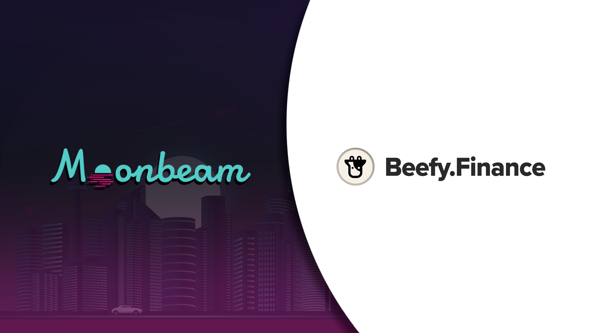
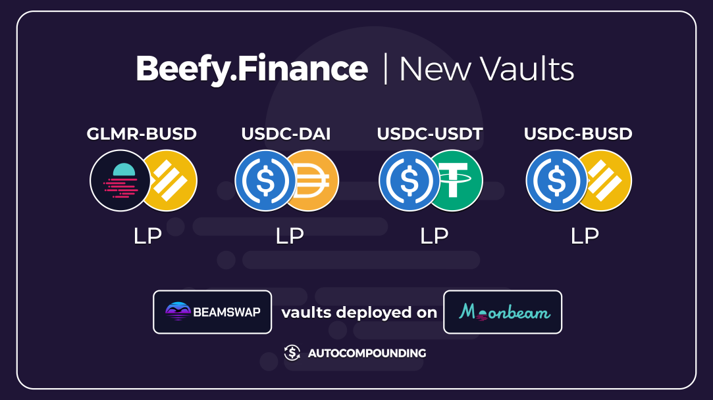
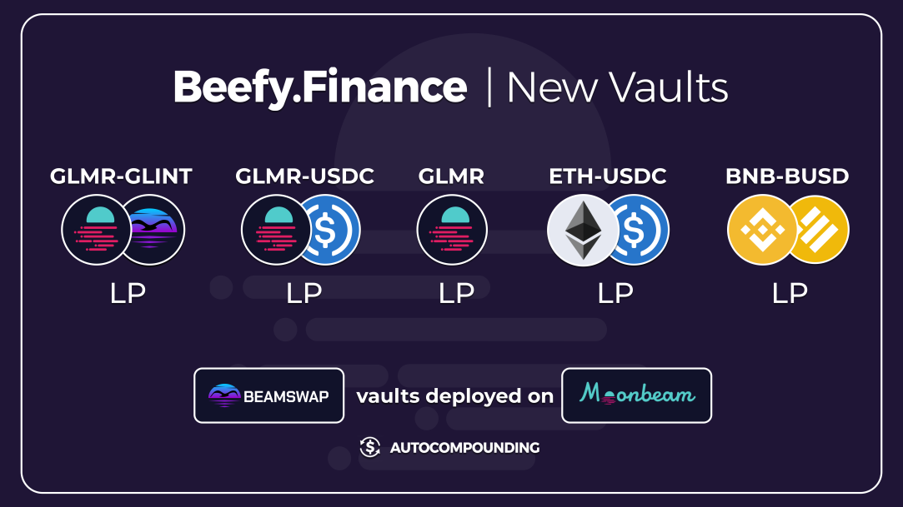

If you’re looking for more chains to auto-compound yields on, we’ve got you covered. Beefy now supports Moonbeam, giving you another fresh opportunity to stake and earn. You may already be familiar with Moonriver, but Moonbeam is a little different. Let’s dive into the relationship between these two chains, the new vaults on offer, and what this means for the Cowmoonity. .

### What is Moonbeam?

Moonbeam is Polkadot’s first fully-functional parachain. The team behind the protocol also runs Moonriver, a parachain on the Kusama network. Moonbeam is EVM compatible while implementing additional features, in particular cross-chain integrations.

### How do you make transactions on Moonbeam? What token do I need?

Just like Ethereum and many other blockchains, Moonbeam uses a gas system for making transactions or interacting with contracts. Fees are payable in GLMR, Moonbeam’s utility token, also used for incentivizing network participation and governance. Compared to Ethereum, Moonbeam provides a cheaper experience when interacting with the blockchain.

### How is Moonbeam related to Polkadot?

To secure a parachain on Polkadot, an auction mechanism is used where the community stakes behind their favorite projects. Over 200,000 stakers delegated roughly a billion dollars of $DOT behind Moonbeam to win its place. The Moonbeam team then began the work of migrating to Polkadot before launching the main net on January 11, 2022.

### How is Moonbeam related to Moonriver?

As well as running Moonbeam, the project also manages Moonriver on Kusama. New code and network changes are implemented first on Moonriver for testing. Once this phase is complete and tweaks are made, the code is shipped to Moonbeam.

### Meet Beamswap, the number one DEX on Moonbeam

Our first strategies for Moonbeam will make use of LPs and farms on Beamswap. Beamswap is one of Moonbeam's most popular DEXs and offers a [bridge](https://app.beamswap.io/bridge) from Binance Smart Chain for $BUSD and $BNB. You can also send $FTM via their [Fantom bridge](https://app.beamswap.io/ftm) and request GLMR from their faucet to start making transactions.

### Which Vaults has Beefy launched?

### How does supporting Moonbeam impacts BIFI holders?

If you’ve read any of our articles before, you know what’s coming. **There will only ever be 80,000 BIFI in existence ever.** Holding BIFI gives you a share of the platform revenue, and more chains mean more revenue streams. This fact puts buying pressure on BIFI, so it’s a win-win situation for the Cowmoonity.
