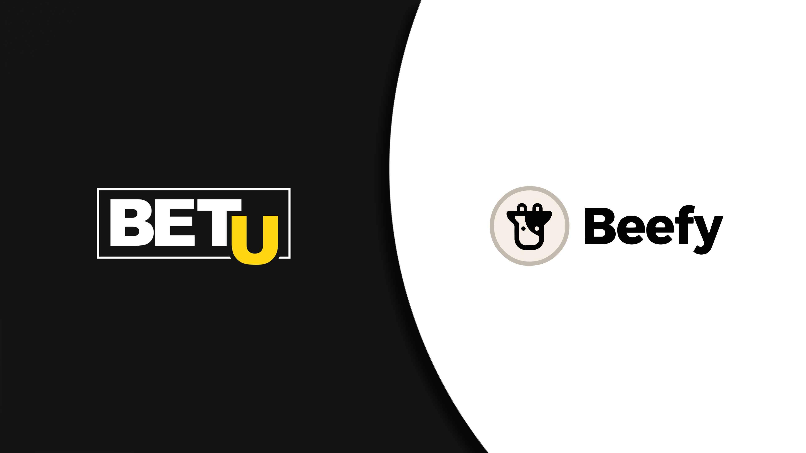

  
The BetU project compromises two separated platforms. BetU Fantasy and BetU

**BetU** is a sports and esports betting platform. Secured by smart contracts and powered by the **$BETU** Token. BetU will offer **traditional bookmaker services** along with **peer to peer** betting resulting in better odds and bigger winnings.

**Bet Makers** can list bets with odds of their choice and **Bet Takers** can accept the best bets available in the marketplace. Individual bet details will be uploaded via **smart contracts** to **blockchain** and funds will be locked until a winner is determined.

[**The BetU Platform**](https://www.betu.io) will enable you to become your **own bookmaker** and bet against your peers.

BetU’s number one goal is to onboard as many users as possible to the **BetU Fantasy** platform (Play to Earn game) and to anticipate the launch of their main Betting Platform in December.

When you register in BetU you will get 1 $BETU, so you can join any league in Division 2 (Free to Play). Have in mind that you will need 1 $BETU token per league. Every week each player receives 1,000 fantasy coins to play with which you can use to make bets on real games in that league.

At the end of the week players who accumulate the most points and arrive on top of the leaderboard **will win real crypto rewards**. All players in the top 100 (both globally and regionally) will receive prizes.

BetU is in a rapid expansion phase so using it and learning about their platform can be beneficial for early adopters.

### BetU Fantasy

[BetU Fantasy](http://www.betufantasy.com) is a free to play game where people can earn real crypto rewards every week for making fantasy bets on sport and esport events. There is no risk, only real rewards. It is a game, there is no cost to play and no real gambling.

There is **$10,000 in rewards per league / per week**. The English Premier League game is live now. An NBA league game will launch on the 23rd of November.

**Join a Division in a League:**

**Division 1**: Play to Earn 3x rewards. Hold 1,000 BETU tokens per league you want to play. Ex: (If players join Div 1 in EPL & NBA they need to hold and stake 2000 BETU).

**Division 2**: Hold 1 BETU token per league. Players get 1 free BETU token to start playing when they register to the platform.

**How it Works:**  
Every week each player gets 1,000 fantasy coins to play with. Players make fantasy bets on the real games played in that league.

At the end of the week the players who accumulate the most points and arrive on top of the leaderboard win real crypto rewards. All players in the top 100 both globally and regionally receive rewards.

If you still have doubts you can watch [this video](https://youtu.be/OHUo-F5nGg8)

### BetU

[**BetU**](http://www.betu.io) is a sports and esports betting platform. Secured by smart contracts and powered by the **$BETU** Token. BetU will offer **traditional bookmaker services** along with **peer to peer** betting resulting in better odds and bigger winnings.

BetU aims to become a leader in the global sports betting market worth $391 Billion USD. With the goal of taking significant market share from global bookmakers such as Bet365, William Hill, Ladbrokes, DraftKings and FanDuel.

**Bet Makers** can list bets with odds of their choice and **Bet Takers** can accept the best bets available in the marketplace. Individual bet details will be uploaded via **smart contracts** to the **blockchain** and funds will be locked until a winner is determined.

BetU’s number one goal is to onboard as many users as possible to the **BetU Fantasy** platform (Play to Earn game) and to anticipate the launch of their main Betting Platform in December.

BetU is in a rapid expansion phase so using it and learning about their platform can be beneficial for early adopters.

### About the $BETU Token

$BETU has many uses and features smartly linked to the success of both the BetU & BetU Fantasy platforms.  
For BetU Fantasy players must hold $BETU tokens to play and earn rewards.  
On the BetU platform the token is the sole currency on the platform and used for all bets, bettering rewards and incentives. $BETU tokens are burnt after every winning bet.

Also if you are interested in BetU’s governance, holding their token will grant you voting rights, so you can choose the future of BetU by holding its token. If you are a Whale Holder of BETU tokens, you will pay zero winning fees.

Also BETU supports the BetU Charity that helps vulnerable children impacted by gambling addiction. Got to love BetU’s kindness.  
ou can buy $BETU [directly on Pancakeswap](https://pancakeswap.finance/info/token/0x0df1b3f30865c5b324797f8db9d339514cac4e94), [Bitmart](https://www.bitmart.com/trade/en?symbol=BETU_USDT&layout=basic), and [Gate.io](https://www.gate.io/trade/BETU_USDT)

### Beefy and BetU

BetU has chosen the leading yield optimizer to be the only place where you can stake your $BETU and earn compounded interest on your deposit. We will follow BetU success closely and bring to Beefy all the farming opportunities on their token.

### Follow BetU on socials

[Youtube](https://www.youtube.com/channel/UCgwmS0tGe20H9tz0-_9AWow)

[Telegram](https://t.me/betucommunity)

[Discord](https://discord.gg/betufantasy)

[Twitter BetU Fantasy](https://twitter.com/BetuFantasy)

[Twitter BetU](https://twitter.com/betuglobal)

[Instagram BetU Fantasy](https://www.instagram.com/betufantasy/)

[Instagram BetU](https://www.youtube.com/channel/UCgwmS0tGe20H9tz0-_9AWow)
