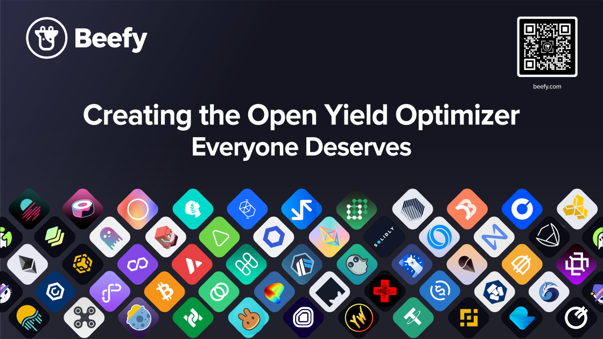

The Multichain Yield Optimizer is more than just a collection of smart contracts designed to maximize earnings. It's a platform that embodies the values of transparency and decentralization that cryptocurrency is built on.

Therefore, Beefy has always been an open-source protocol with nothing to hide and no barriers to developmental participation. Beefy also takes this responsibility seriously, and we’re here to show it. Our team will always champion openness, security, and transparency in our work for the Cowmoonity.

Nowhere is this more obvious than with the release of our v2 code to the public. Anyone, anywhere, can dive deep into our smart contracts and take a look under the hood. But that’s not the only thing about Beefy that is transparent either.

### What makes Beefy an open platform?

#### The Beefy DAO

Beefy operates one of the most active DAOs of any protocol. This even extends to our social media marketing. If you’ve ever visited our discord, you’ll probably have seen the active discussions open to all.

Snapshot governance also provides a fair way for any Beefy holder to take part in the running of Beefy based on their $BIFI holdings. Holders can suggest changes via proposals and vote on implementing other users’ ideas.

#### Smart contracts

It’s no secret our smart contracts are fine-tuned earning machines. They’re also no secret period. Our smart contracts are open for users to see, scrutinize, and examine as they wish. With your funds being invested, why shouldn’t you know exactly what we’re doing with them? It’s a cornerstone of our philosophy and platform security, and we’re proud of it.

#### Beefy v2 repo going open Source

Our v2 app came off the back of our multi-chain development. For older users, you may remember switching between different versions to access different chains. Now, our users have a multichain experience within a single app. This involved a huge engineering challenge as the app loads 15 different blockchains at the same time.

We’re incredibly proud of our work, so we’re opening our Github front-end repository for everyone to see. This opens the door to welcome new contributors to the project, and let others fork the current codebase. We believe this will help jumpstart many projects that want a native multi-chain app, nurturing more innovation in the space.

#### Approachability

No matter if you’re meeting us in person at a conference or just hanging out on Telegram, it’s easy to get in touch. We’re always open to ideas and ready to engage with our community in a variety of ways. Questions make our services stronger, so please reach out if you have suggestions or need more information.

### Beefy continues to lead in transparency

At Beefy, we’ve all got something special. Our dedication to openness and transparency has made up a leading service in the yield optimization game. As we move forward, the plan still stays the same: maintain an open earning system that truly benefits all users.
