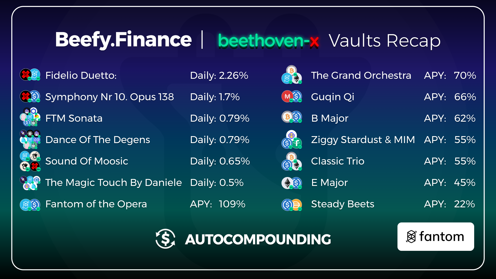
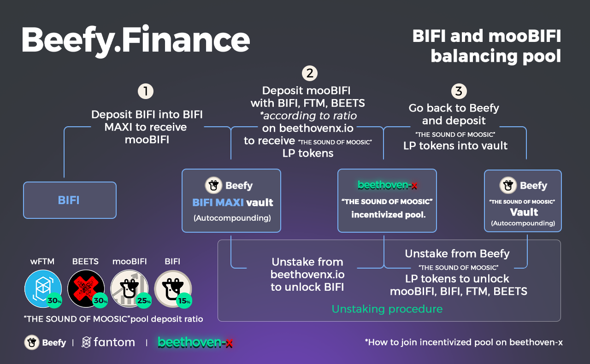

We all watched those viral youtube videos of cows gathering around a guy playing the accordion. Our latest partner will sound like music to cows ears, meet our undead friend, BeethovenX.

### **About BeethovenX**

BeethovenX is a one-stop decentralized investment platform on Fantom Opera.

They leverage best in breed DeFi protocols to offer novel decentralized investment strategies. Built on Balancer V2, BeethovenX is the first next-generation AMM protocol on Fantom. BeethovenX builds on the strong foundation the Balancer team has laid by creating an automated portfolio manager, liquidity provider, and price sensor. It turns the concept of an index fund on its head: instead of paying fees to portfolio managers to rebalance your portfolio, you collect fees from traders, who rebalance your portfolio by following arbitrage opportunities. The BeethovenX swap offers highly competitive rates for swaps as it uses a system that intelligently sources liquidity from multiple pools to automatically figure out the best available price from the range of available pools.

### **How To Deposit**

In order for Beefy to do the magical auto-compounding, you need to first provide liquidity on their platform. To do this you have to click the “Add liquidity” button on Beefy’s vaults, and this will take you directly to BeethovenX’s pool.

Conventional Liquidity Pools are 50% token A, and 50% token B. In BeethovenX it is a bit different. Pools can have many tokens, and different % distributions, for example if you want to provide liquidity in BEETS-wFTM, you need to deposit 80% BEETS and 20% wFTM.

To provide liquidity without suffering slippage, you have to provide the tokens in the correct ratio, but if you don’t mind a bit of slippage (Check “Price impact: %” at the bottom of the screen), you can provide just one token (In this case only BEETS, or only wFTM) and Beethoven will take care of doing the distribution.

Bingo! You just provided liquidity on Beethoven-x, now only what is left is depositing that LP tokens in Beefy, and let the Cow do the auto-compounding for you. Wasn’t that simple? Now that you are a Liquidity Pool expert you can enjoy these sweet APYs in the following vaults:

### **What are mooTokens?**

If you interacted with Beefy before, you would have noticed that after you deposited in any Beefy vault, you received in exchange a new token with the prefix “moo” that represents your share in the vault. Beefy always recommends not selling your mooTokens on unsupported platforms, because most of the time this will result in a loss of funds. However lately more and more Dapps are giving utility to mooTokens.

### **Meet "The sound of moosic" Pool**

Our ghastly friends over at Beethoven-x created a balanced pool for the Cowmoonity, that contains the following assets: 30% wFTM, 30% BEETS, 25% mooBIFI (This is Beefy that has been deposited on the BIFI Maxi vault on Fantom), and 15% BIFI.

You already know how to invest in this pool from the “How to deposit” section, but just in case, we will leave you an explanatory image on the process.

