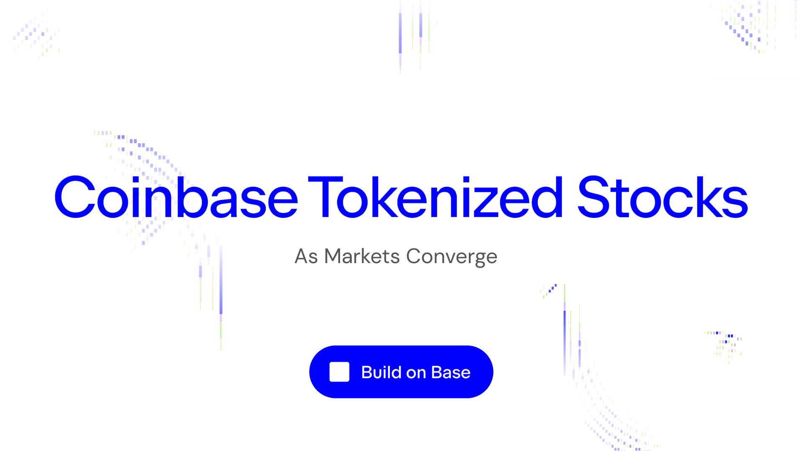

Equity changed the world. In Ancient Rome, investors supported their society's expansion into Asia Minor by pooling funding in exchange for a share of the tax proceeds from the new territories. 400 years ago, the world's first joint-stock enterprise - the Dutch East India Company - aligned the necessary incentives to usher in an age of global trade and unprecedented improvements in material living standards. And today, enormous scientific and technological ambitions can be pursued with hundreds of billions of dollars in funding long before they've earned a dollar of profit with the support of sophisticated global equity markets. Equity facilitates the convergence of interests. 

In each of these examples, investing has been shaped by more than just demand. It requires market infrastructure, distribution, settlement, custody and access. For millennia, that infrastructure has decided who can reach which markets, when they can trade, how capital moves, and how easily an asset can become useful beyond simply sitting in an account. As the world moved from funding decades-long conquests to sub-second latency for information requests, our infrastructure has unlocked new opportunities for tangible economic growth.

Over the last decade, blockchains have changed the infrastructure layer of our financial system with decentralized finance, stablecoin payment rails and asset tokenization. They have made ownership programmable, settlement faster, markets more global, and different assets more composable with one another. But the really interesting part is not just improving the statistics for old assets on new platforms; it's unlocking new utility for those assets once they do arrive.

Tokenized stocks are the next major unlock for blockchains: familiar financial assets moving through onchain liquidity, gifting onchain users new routes into traditional-market exposure, and unlocking the power of DeFi to better utilise equity assets and accelerate their growth.

Today, we're pleased to announce that Beefy is partnering with Coinbase for the launch of Coinbase Tokenized Stocks. Together, we're helping to showcase the power of DeFi to bootstrap adoption and leverage the utility of the next generation of equity investments. 

## Tokenized Stocks

Tokenized stocks take one of the most globally understood asset classes and move its exposure onto programmable rails. That matters because equities already have deep cultural, financial and institutional weight. When they become usable onchain, they can start plugging into liquidity pools, vaults, lending markets, perpetual derivatives, bridges and other DeFi primitives.

The immediate benefits are simple enough: broader market reach, faster onchain settlement, cleaner integrations, and a new kind of financial composability. But the longer-term implications of those changes may be far greater: more issuers, more listings, more DeFi integrations and more product differentiation are coming. Over time, tokenized equities can become part of entirely new IPO routes and capital formation models, opening distribution channels and liquidity designs that traditional infrastructure was never built to support.

It's for this reason that leading players in the space are racing to offer tokenized stocks. Crypto behemoths like Coinbase and Binance are being joined by new entrants from other financial industries like Robinhood, each bringing distinct userbases and value propositions to experiment with the optimal distribution of tokenized equities. As they do, a tidal wave of incentives and launch campaigns race towards our shores, ready to shake up the portfolios of yield farmers and institutional investors alike.

We would be remiss not to mention that tokenized equities bring tradeoffs around product structure, liquidity design and market behavior. Where some issuers like Coinbase have focused on full custodial backing and redemptions, some tokenized stocks are little more than synthetic price trackers intended purely for rough exposure. This disparity in approach is normal for these types of frontier categories. However, the direction of travel is clear: tokenized stocks are now racing to evolve from abstract thesis to core DeFi utility.

## Stocks Arrive On Beefy

Beefy has been preparing for this moment longer than most. We have vaulted early tokenized stock concepts multiple times before, and in doing so have seen the category move from niche experiments toward a more serious market led by major players like Coinbase and Robinhood. We're acutely aware of the risks posed by insufficient redemption options, and in a strong position to support the necessary liquidity bootstrapping to deliver these products to the masses. 

Our role is to attract and retain strong liquidity, enabling these products to facilitate large trades from market participants of every size.

Today, Beefy launches Coinbase Tokenized Stocks on Base with our Cowcentrated Liquidity Manager (CLM) products: Beefy's automated layer for concentrated liquidity management that unlocks massive liquidity with minimal capital deposits. Our CLMs help create deeper, tighter liquidity around the relevant trading range. That means lower price impact, reduced slippage, less idle capital than broad passive liquidity, and a stronger base for tokenized-stock markets to grow.

For users, CLMs remove the worst parts of managing concentrated liquidity manually. Beefy handles position management, rebalancing, compounding and shared gas costs, so users can access the strategy through a vault instead of spending their time watching ranges. Beefy manages the complexity of concentrated liquidity, helping users manage market risks and minimise their exposure to impermanent loss through rebalances.

From day one, users can also use [Beefy's Crosschain Zaps](../2026-03-No-055-Crosschain-Zaps/zap-v4.md) to reach Coinbase Tokenized Stocks products with less friction from any of our 10 supported chains. Simply find the product you want on Base, decide whether to deposit from your wallet or another Beefy vault, and our web app will generate the most efficient route for bridging, swapping and depositing into your chosen product. 

As tokenized stocks expand, we expect Beefy to play a key role: the one-stop shop where users can access stock products across providers, protocols and chains with minimal effort. Vaults, Zaps, Boosts and incentives are how these assets evolve from a source of exposure to a means of utility.

## Coinbase Tokenized Stocks Partnership

As a launch partner for Coinbase Tokenized Stocks, Beefy will be helping to bootstrap liquidity for its new tokenized stock products through CLM products built on Aerodrome liquidity pools.

Coinbase Tokenized Stocks launched today (24 August 2026) on Base using Coinbase's [B20](https://docs.base.org/base-chain/specs/upgrades/beryl/b20/specification) token standard for composable assets. Stocks on Coinbase provide direct economic exposure backed 1:1 by underlying shares. Regulated custody sits alongside that backing as a separate credibility point.

To turbocharge this launch, Coinbase has orchestrated three layers of incentivization working together in tandem:

* Aerodrome emissions will be directed to liquidity pools for the new stock products through weekly gauge votes;
* Beefy's CLMs will then be the exclusive recipient of USDC incentives provided by Coinbase through [Merkl](https://app.merkl.xyz/?search=beefy\&chain=8453) across two-week epochs; and
* Beefy will match Coinbase's incentives with Beefy boosts every two weeks using our own mooBIFI token distributed through our own reward pools in the Beefy protocol.

All three layers of incentives are now live. And Beefy users can tap into all three at once just by depositing into our Boosted CLM Vaults and clicking the "Boost" button. In the first epoch, all four of the first Coinbase Tokenized Stocks CLM Vaults will be receiving incentives for the next two weeks:

- META: [https://app.beefy.com/vault/aerodrome-cow-base-usdc-metac-vault](https://app.beefy.com/vault/aerodrome-cow-base-usdc-metac-vault)
- NVDA: [https://app.beefy.com/vault/aerodrome-cow-base-usdc-nvdac-vault](https://app.beefy.com/vault/aerodrome-cow-base-usdc-nvdac-vault)
- GOOGL: [https://app.beefy.com/vault/aerodrome-cow-base-usdc-googlc-vault](https://app.beefy.com/vault/aerodrome-cow-base-usdc-googlc-vault)
- AAPL: [https://app.beefy.com/vault/aerodrome-cow-base-usdc-aaplc-vault](https://app.beefy.com/vault/aerodrome-cow-base-usdc-aaplc-vault)

More Coinbase Tokenized Stocks will be released in the coming weeks and months, joining the existing incentive campaign to support their bootstrapping. Keep your eyes peeled to the Spotlight section of the Beefy app to see which vaults are currently being incentivized in any given week.

## As Markets Converge

Equity changed the world by empowering the convergence of human interests. Now, the world looks set to change again as the very equity markets that unlocked that change themselves converge under the influence of new technologies at the cutting-edge of global finance.

Coinbase Tokenized Stocks unlock equity exposure on Base and facilitate boundless new utility for Coinbase users who hold and trade equities. Through our launch partnership, Coinbase and Beefy will help to bootstrap liquidity for this new asset class, facilitate simpler access through our sophisticated app and novel zap tooling, and route incentives to the users and liquidity that are most needed by an expanding user base. This is how tokenized stocks will move from market-structure thesis to massive adoption through DeFi primitives.

And this partnership is only the start: as more tokenized equities come onchain, Beefy will be there to help the convergence of interests across lending, derivatives, bridges and all-new forms of capital formation. 

For now, the bootstrapping has already begun: head to [Beefy.com](https://app.beefy.com), zap into Coinbase Tokenized Stocks with one click, and boost your positions to benefit from three layers of incentives.

[B20 Docs](https://docs.base.org/base-chain/specs/upgrades/beryl/b20/specification) | [Coinbase Tokenize](https://www.coinbase.com/en-gb/tokenize) | [Beefy on Merkl](https://app.merkl.xyz/?search=beefy\&chain=8453) | [Beefy App](https://app.beefy.com/)