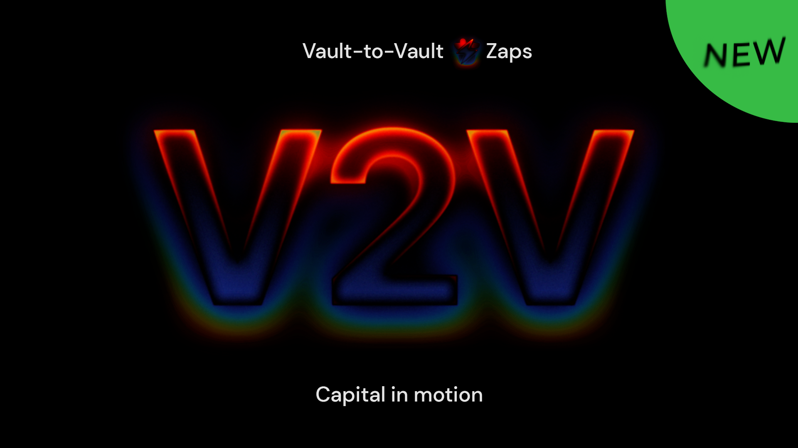

DeFi has spent years obsessing over liquidity. Pool depth, trading volume, chain TVL... the market has emphasized the importance of measuring where capital sits, how much is available, and to whom it is attributable.

But liquidity is only half the story. For financial capital to realize its potential, it must be able to move, adapt and respond. Ecosystems inhabited by large stockpiles of useless and unwanted tokens tend to create a lot less value than their nimbler neighbors, with less liquidity turning over fast. At the user level, portfolios that are technically-liquid but practically-dormant can often exacerbate — rather than help — the problem of liquidity fragility.

The fact is: most DeFi assets are still managed one position at a time. Users choose a product, deposit capital, monitor the result, then manually unwind before rebuilding the next deployment when their strategy changes. Even when new opportunities are obvious, most users will not promptly seize the better yield or migrate to the newer product because of all the steps involved in withdrawing, transferring and redepositing.

Beefy is on a mission to help right this wrong. By connecting dozens of underlying protocols and chains through a single access point, we help to distribute user capital to a full range of yield opportunities across the EVM universe without friction. Over the last few years, our Zap technology has massively condensed the workload for users to manage individual positions. That progress is the sum of countless small iterations, rolled out consistently and piled on top of one another over time.

Today, we're excited to launch the next major iteration of Zap: **Vault-to-Vault Zaps**, or **V2V**, a platform-level upgrade to set capital in motion across hundreds of Beefy vaults on 10 of our leading blockchains.

## Vault-to-Vault Zaps

V2V is an extension of [Zap V4](https://beefy.com/articles/zap-v4/) that lets users move from any supported Beefy product to other products in just one click. Where Token-to-Vault Zaps have been the norm for years, V2V halves the workload for users in withdrawing from one product and depositing to another.

These efficiency gains matter because Beefy wants to avoid creating siloed products and user experiences. With V2V, our vaults become part of a broader network: different protocols, chains, assets, incentives and strategy types connected through one interface. It means elevating interconnectivity for our Beefy mooTokens through a common movement layer.

Under the hood, V2V builds on Zap V4's core components by adding more advanced routing logic and backend systems. For users, the main difference is the new frontend elements for switching between token and vault interactions, and pairing with another vault from your portfolio. The upgrade also introduces a cleaner fee standard, with Zap swap fees now fixed at **0.05%** of assets swapped across same-chain, crosschain, Vault-to-Vault, deposit and withdrawal Zap transactions.

Perhaps the most exciting thing about V2V Zaps is the host of possibilities they unlock for our future:

## Plans In Motion

In moving from single-product to multi-product Zaps, V2V opens the door to portfolio-level efficiency across the Beefy ecosystem. Rebalancing exposure has never been easier by managing your portfolio positions from your [Dashboard](https://app.beefy.com/dashboard), and navigating the relevant vault pages to zap between your allocations. It's easy to imagine a world where multiple portfolio reallocations can be mapped out and executed in parallel from the comfort of your Dashboard. 

That movement layer also extends beyond individual user reallocations of their Beefy portfolios. Because Beefy's Zap Router handles arbitrary logic, it also becomes possible to integrate with other DeFi protocols, so that users can zap deposits from elsewhere for faster migrations and better interoperability with the rest of their portfolio. Our vision is not just making Beefy easier to use, but making all of DeFi more fluid with Beefy as a connecting interface.

V2V also promises to revolutionize the way we think about externally-driven events that routinely impact large swathes of Beefy's catalog. When a new chain launches, or a protocol is upgraded or replaced, thousands of users are left to their own devices to discover the changes and adjust their portfolios accordingly, frequently leaving many behind. V2V helps solve this problem by delivering dedicated routes to move capital in response to these opportunities directly to relevant users. It's a perfect opportunity for partners to work with Beefy to keep our users up-to-date, tap into their fluid capital, and even offer them incentives to make the switch.

For example, as part of the ongoing preparations for the Aero launch in July, Beefy has been collaborating on a campaign to migrate our user positions from old Slipstream products to the new protocol's design. With V2V, we now offer a Migration Module on the vault page for affected products, providing users with a route to their new replacement. The Migration Module is live now for impacted Aerodrome and Velodrome products, and will become a fixture for similar changes in the future. 

We're also pleased to announce that we'll be turbocharging the debut of V2V Zaps with a new kind of incentive campaign:

## Launch Campaign

To showcase V2V in practice, we're launching the first ever **Fee-free Zaps** on the Beefy web app. By *"Free Zap"*, we mean that Beefy waives its Zap swap fee on promoted V2V routes, making our fastest-ever capital flows cheaper than ever as well. Users still pay gas fees on the source chain, and bridge/relay fees for crosschain routes; however, swap fees are often the largest component, so this presents a greater saving for larger positions.

To participate, watch for the final **Free Zap** and **Migrate** tags on included products in the Beefy web app, which will be the main source of truth for which incentive programs are currently live. Anyone conducting a Zap on the promoted routes will receive the benefit upfront on their existing assets; no waiting for future reward airdrops in other tokens. There are no minimum requirements or additional participation criteria — just use the correct products and an included route to benefit. 

The initial promotion covers 3 PancakeSwap SOL liquidity pools that are currently receiving USDC incentives via Merkl which have been issued by Base as part of their DeFi Summer campaign. The Free Zap applies to any Vault-to-Vault deposits from any chain into the [SOL-USDC](https://app.beefy.com/vault/pancakeswap-cow-base-sol-usdc-vault), [SOL-cbBTC](https://app.beefy.com/vault/pancakeswap-cow-base-sol-cbbtc-vault) and [JitoSOL-SOL](https://app.beefy.com/vault/pancakeswap-cow-base-sol-jitosol-vault) CLMs on Beefy. Token-to-Vault deposits are excluded.

The Launch Campaign starts on **Friday 19 June 2026** and will continue over the coming weeks. As Base's DeFi Summer campaign continues throughout the summer, we will seek to update the range of products benefiting from Free Zaps over time. We'll also be using this opportunity to test usage, analyze results and adjust Beefy's incentivization strategy.

## Capital In Motion

Vault-to-Vault Zaps are so much more than a deposit shortcut; they're a great leap forward for portfolio fluidity on Beefy.

DeFi already has plenty of places for liquidity to be parked and forgotten about. The challenge is building better systems that set capital in motion when new opportunities arise.

That's what V2V unlocks: interconnected vaults, smoother migrations, natively-integrated campaigns... No more product-by-product management. A thriving network of crosschain capital. A product catalog that feels less like countless shelves of stock and more like a living fulfillment center, helping optimize your inventory of capital and yields.

It's never been easier to find opportunities and move assets throughout the EVM universe with Beefy. We keep inching closer to our vision for the optimal user experience in DeFi: one interface connecting all kinds of underlying protocols, chains and yield sources.

Interconnected Vaults. Portfolio fluidity. Capital in motion.

[Beefy App](https://app.beefy.com/) | [Zap Docs](https://docs.beefy.finance/beefy-products/zap) | [Beefy Discord](https://beefy.com/discord)