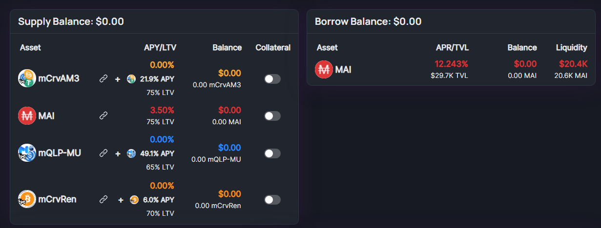

It’s well-known the Beefy Cowmoonity loves a good stablecoin. So what could be better than using your mooTokens to get stablecoins you can use to make some sweet gains? Don’t let your mooTokens gather dust and get to know our brand new partnerships with QiDao and Market.xyz. You’ll be mooving your mooTokens over in no time.

### What is the QiDao Protocol?

QiDao lets you hold onto your crypto while also allowing you to spend its extracted value. By staking your crypto, you can borrow the MAI stablecoin at 0% interest, with each token pegged to the dollar. Your crypto simply acts as the collateral.

To mint MAI, a user deposits their tokens into a specific MAI vault for their cryptocurrency on the Polygon, Fantom, Solana, or Avalanche networks. MAI is overcollateralized, meaning that you will only receive stablecoin at around two-thirds of the value of your crypto deposit.

### What is the Market.xyz?

With Market.xyz, users can instantly access liquidity and leverage their assets’ value. By depositing your tokens in their isolated pools, you can borrow and lend for other coins. The project’s goal is to ultimately allow for opportunities to earn yield and leverage isolated markets for a wide range of projects and DeFi communities.

### What are mooTokens?

Anytime you deposit in a Beefy vault, you’ll receive mooTokens as a receipt. For example, if you deposit BNB into the BNB Vault, you’ll receive mooBNB tokens that represent your share of the vault. The amount won’t match 1:1, but you’ll always get back your original deposit plus any interest earned. Beefy always recommends not selling your mooTokens on unsupported platforms, because most of the time this will result in a loss of funds. However lately more and more Dapps are giving utility to mooTokens. This means that you can deposit your mooTokens in other projects like QiDao or Market.xyz, or provide liquidity on BeethovenX.

### What chains and mooTokens are supported?

Currently, you can borrow MAI with mooTokens from the following vaults on Polygon:

**Curve USDC/DAI/USDT**

**Curve renBTC/WBTC**

**QuickSwap MATIC/USDC**

You can borrow up to 70% of the value of what is deposited depending on the vault. Isn’t this awesome? More mooTokens and chains will be accepted soon.

### How can you get MAI with your mooTokens?

You can mint MAI directly from Mai.Finance, at 0% interest, and get charged a 0.5% fee when repaying your debt. You can also lend your tokens directly on Market.xyz, and borrow MAI at a variable rate depending on pool utilization.

Currently to get MAI you need to supply your mooTokens into market.xyz, and activate them as Collateral. After that you will be able to borrow MAI at a variable rate depending of the utilisation of the pool.

In the near future QIDAO will be accepting mooTokens as collateral to Mint MAI directly on their site, how it’s currently available with other tokens like camTokens (Compounding AAVE Market Tokens, or receipts of tokens deposited on AAVE).
