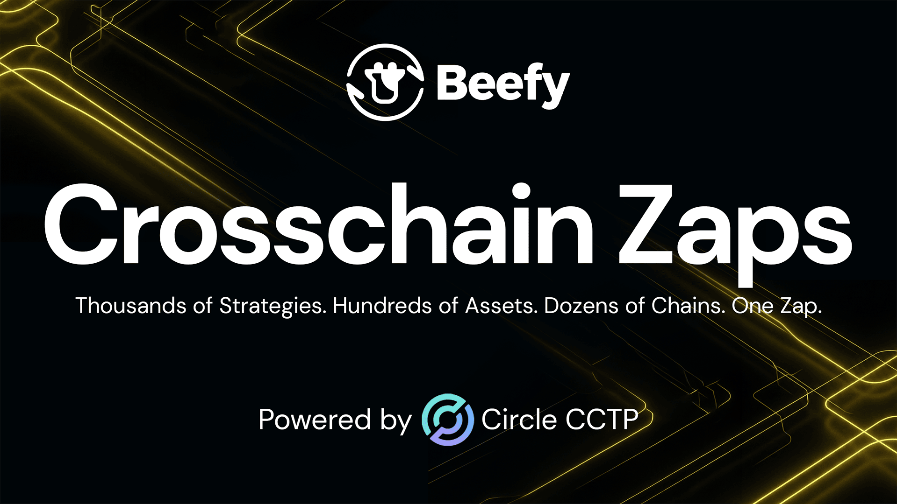

Amidst difficult times for DeFi and the world economy, it can be easy to fall into doubt. *What are we doing here? What change are we trying to bring to the world? What’s the real value of these tools and this work?*

To paraphrase some timeless wisdom: it’s too easy to fall when you don’t stand for anything.

Neutrality, optimisation, efficiency and automation have always been some of the core values that Beefy represents. However, in 2026, one core value stands head and shoulders above the rest: that’s *usability*. In an age when DeFi and TradFi must grapple to capture the value of growing adoption, usability will make all the difference.

Beefy’s expansive deployments and neutral integrations helped grow our platform into the best place to go looking for opportunities across dozens of chains, hundreds of assets, and thousands of strategies. But one product in particular has helped Beefy to convert our enormous availability into *ease of access* and *usability*. **That product is Zap.**

For those not already familiar, Zap aims to grease the gears of our DeFi engine. It removes friction and facilitates smooth interconnection by bundling different operations into the same transaction. On Beefy, this allows users to deposit and withdraw from thousands of products — sometimes wrapped within 5 or 6 different protocols — in just one transaction, and from dozens of assets on the chain.

Today, we’re excited to announce the next phase in making your life easier. It’s time for a new generation of zap technology, thousands of additional routes to interact with Beefy, and an even-smoother experience for our users. We’re pleased to share how **Zap is going crosschain.**

## Crosschain Zaps

It’s an upgrade that does exactly what it says on the tin… Users are now able to enter hundreds of Beefy products from their chosen token across 10 of our supported blockchains. Just select the route, approve the deposit token and zap in one transaction.

This expansion is a significant milestone for Beefy’s user experience. The lines between active users and set-it-and-forget-it investors have become blurred. Users no longer need to learn the nuances of each chain or spend time figuring out the bridging process. Just point, click and zap to surf between vaults in the Beefy web application.

Beefy’s UI has also been upgraded to handle the entire workflow from start to finish. These systems are built for scale, capable of handling hundreds of zap transactions simultaneously when new chains and promotions are launched. They’re also robust, designed to handle external issues with the swap and bridge providers at each stage. 

As Beefy’s first major release in 2026, crosschain zaps deliver on a long-held dream of the Beefy community. And we’re far from done realizing the potential that crosschain deposits on Beefy will unlock.

Crosschain zaps are available now on the Beefy app for Ethereum, Base, Arbitrum, OP Mainnet, Polygon, Avalanche, Linea, Monad, HyperEVM and Sonic.

## Zap V4

Crosschain zaps are the fourth major release in Beefy’s suite of zap tooling. Since early 2021, we’ve been gradually iterating and improving on our existing designs, seeking to unlock new functionality that makes users’ lives easier. 

Our last release — [Zap V3](https://beefy.com/articles/zap-v3/) — extended Beefy’s reach to dozens of assets offered by multiple integrated aggregators on your chosen chain. V4 now stretches the service to any supported asset on any supported chain. That’s an expansion from *dozens* of deposit options to **hundreds**.  

To reach this long-awaited milestone, we’ve constructed brand new systems onchain and offchain to facilitate the transfer of assets. Our new \`CircleBeefyZapReceiver\` contract serves to relay bridging messages and trigger the deposit zap on the destination chain. 

Offchain, the receiver is supported by the Beefy Hook Executor, a service that listens for bridging events on the source chain, fetches bridging attestations, and triggers the Receiver’s relay function. 

All of these complex operations are facilitated by the existing BeefyZapRouter, which is capable of handling arbitrary zap logic. This means no upgrades to the existing user-facing contract on the source chain, and all the same functionality as the previous V3 in the same implementation as the new V4.

Further information about each of the components of Zap V4 is available in our documentation.

However, the real heart of the new system is the bridging service that delivers seamless crosschain transfers. For that, we’re delighted to be building crosschain zaps, on top of Circle Cross-chain Transfer Protocol (**CCTP**).

## CCTP

CCTP is a permissionless onchain utility that enables the flow of USDC across chains through native burning and minting. With CCTP, USDC is effectively teleported from one blockchain to another.

This makes CCTP the perfect intermediary through which to transfer USDC: the standards are consistent across different environments, the value is designed to be stable and recognised everywhere, and DeFi liquidity is prioritised and well-supported. Where most other bridging solutions must stitch together a fabric of different native tokens and smart contract standards, CCTP and USDC keep things simple and reliable.

## One Click

For years now, zap technologies have sat at the centre of Beefy’s crusade to make DeFi easy. DeFi can be difficult, time-consuming and risky, all of which can make it inaccessible for ordinary users. By combining our best-in-class compounding technologies with ease-of-access tooling like Zap, Beefy makes a world of DeFi opportunities available to users of all skill levels with just one click.

In elevating Zap to stretch across chains, V4 offers a seamless user experience no matter where your funds are located. And, by abstracting chains, tokens and protocols, it will push Beefy further towards a truly complete crypto interface that provides users with everything they need to access DeFi.

As we complete this next phase of Zap’s evolution, a world of limitless access and possibilities approaches. But we’re far from done here — a greater variety of workflows, more targeted zap opportunities, and a stronger system of discovery and referral all lie ahead.   
The future is bright with Zap.

[Beefy App](https://app.beefy.com/) | [Zap Docs](https://docs.beefy.finance/developer-documentation/zap-contracts) | [CCTP Docs](https://developers.circle.com/cctp)